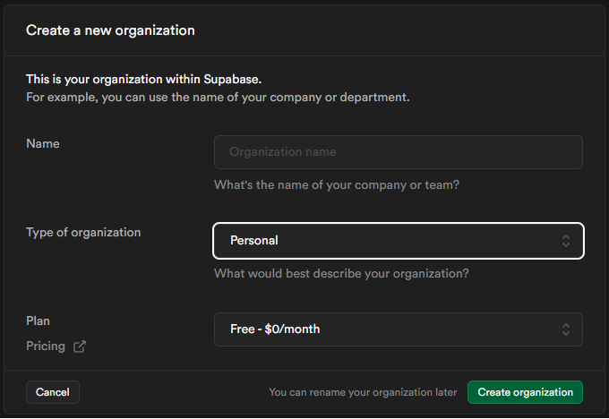
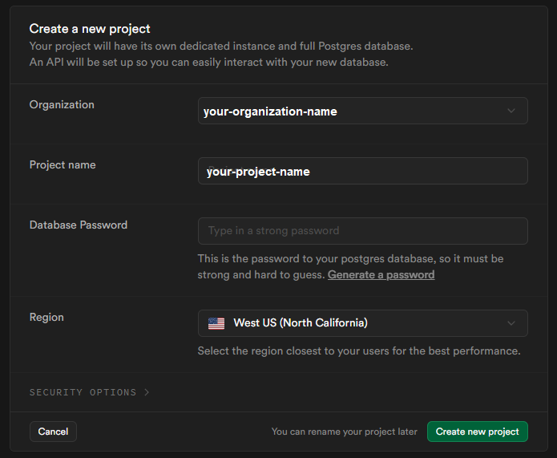
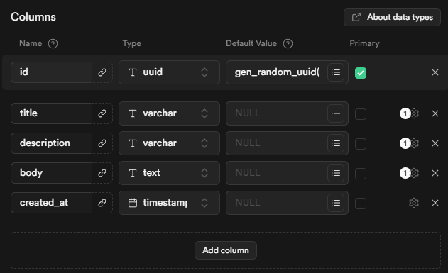
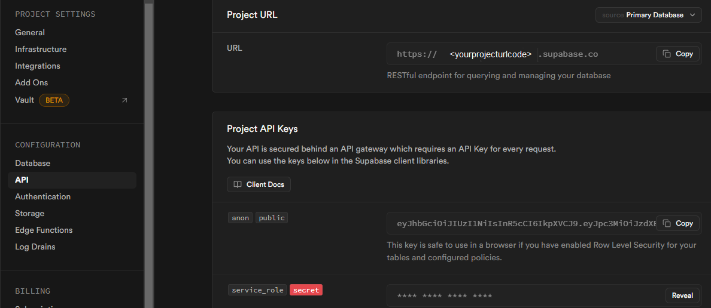

# Desafio de Projeto - Criando o Seu Blog Pessoal com Next.JS - Bootcamp DIO e XP Inc, Fullstack Developer com .NET e C#

Este projeto foi desenvolvido no bootcamp mencionado acima. A proposta inicial era somente reproduzir e conectar ao banco de dados do Supabase via API, retornando um único post via ID. Adicionei 3 itens de usabilidade: Voltar(pág. inicial), Criar Post(new post) e Apagar Post.

## Instalar:

Via CLI, 'yarn install' ou 'npm install' devem resolver as dependências. Depois, 'npm run dev'. Aspas não são incluídas para estes comandos no CLI.

## Troubleshooting - O DB não conecta:

Pode ser que com o tempo o banco de dados não esteja mais disponível (apagado do Supabase, como no projeto original de onde este foi clonado), mas ele ainda funcionará se seguidos alguns passos:

### Criando o projeto e Database:

No Supabase: Crie uma nova organização, dando nome, tipo e escolhendo o plano. Clicar no botão 'Create organization'.



Criada a Organização, crie um novo projeto selecionando a Organização recém criada, dando nome ao projeto, e criando um database password (pode ser criado também via opção Generate Password, logo abaixo do campo). Selecione, Create new project.



Criado o projeto, crie uma nova tabela em New Table, configurando-a nos campos da seguinte forma:

  Name: posts -> será o nome da tabela

  Colunas -> Selecionar Add column e configurar da seguinte forma:

  | Name      | Type       | Default Value    | Primary   |
  |:----------|------------|------------------|-----------|
  | id        | uuid       | gen_random_uuid()| Checked   |
  | title     | varchar    | null             | Unchecked |
  |description| varchar    | null             | Unchecked |
  |body       | text       | null             | Unchecked |
  |created_at | timestamptz| null             | Unchecked |



### Conectando ao DB:

Após criar a tabela e as colunas, na barra lateral em Project Settings, na aba API, você encontrará sua projectUrl e as duas Project API Keys, uma anon public - anônima pública - e uma service_role secret, que pode ser acessada pelo botão Reveal.



De posse das chaves, vá até o arquivo /services/api.js e substitua os valores nas variáveis:

    const supabaseUrl = "https://<suaUrlAqui>.supabase.co";
    const supabaseKey = "suaChaveAnonPublicAqui"

    export const api  = axios.create({
        baseURL: `${supabaseUrl}/rest/v1`,
        headers: {
            APIKey: supabaseKey,
        }
    })

Caso a chave não funcione, duas opções possíveis: 

1 - No lugar da chave anon public, substitua o valor em supabaseKey pela chave service_role secret, adicionando no headers o valor authorization e passando a chave:

    const supabaseKey = "suaChaveServiceRoleSecretAqui"

    export const api  = axios.create({
        baseURL: `${supabaseUrl}/rest/v1`,
        headers: {
            APIKey: supabaseKey,
            authorization: `Bearer ${supabaseKey}`
        }
    })

2 - (Não seguro) na tabela, clicar no botão Add RLS policy e na nova tela que abrir, Disable Row Level Security, Confirm. O fator que torna não seguro é que sua tabela será publicamente editável (Row Level Security is disabled. Your table is publicly readable and writable.).

O Projeto deve funcionar normalmente a partir daqui.
Caso não, ver documentação do Supabase em: [text](https://supabase.com/docs/guides/api)


[](https://app.netlify.com/start/deploy?repository=https://github.com/netlify-templates/nextjs-blog-theme)

A customizable blog starter using:

- [Next.js](https://github.com/vercel/next.js) v12
- [Tailwind](https://tailwindcss.com/) v3.0
- Built-in [MDX](https://mdxjs.com/) v1 support
- Includes modern design with dark & light themes

> 🎉 We’re really excited about the Bejamas + Netlify collaboration and we were going to celebrate it with some swag, but we realized we could put that money into supporting OSS and our ecosystem even more! After all, who needs another t-shirt or sticker?!
>
> [Click this link](https://oss-form.netlify.app/) to vote for your favorite Open Source project!


[Take a gander at the demo.](https://bejamas-nextjs-blog.netlify.app)

[Click here to watch the template walkthrough!](https://www.youtube.com/watch?v=63QZHs259dY)

## Table of Contents:

- [Getting Started](#getting-started)
  - [Setting Up Locally](#setting-up-locally)
  - [Using the Wizard](#using-the-setup-wizard)
- [Configuring the Blog](#configuring-the-blog)
- [Adding New Posts](#adding-new-posts)
- [Testing](#testing)
  - [Included Default Testing](#included-default-testing)
  - [Removing Renovate](#removing-renovate)
  - [Removing Cypress](#removing-cypress)

## Getting Started

---

You can get started with this project in two ways: locally or using the [setup wizard](https://nextjs-wizard.netlify.app/).

### Setting Up Locally

If you're doing it locally, start with clicking the [use this template](https://github.com/netlify-templates/nextjs-blog-theme/generate) button on GitHub. This will create a new repository with this template's files on your GitHub account. Once that is done, clone your new repository and navigate to it in your terminal.

From there, you can install the project's dependencies by running:

```shell
yarn install
```

Finally, you can run your project locally with:

```shell
yarn run dev
```

Open your browser and visit <http://localhost:3000>, your project should be running!

### Using the Setup Wizard


Through the [setup wizard](https://nextjs-wizard.netlify.app/), you can create your blog in a few clicks and deploy to Netlify.

## Configuring the blog

The config is based on environment variables to make it easy to integrate with any Jamstack platform, like Netlify.

Here are the variables you can edit:
| Variable | Description | Options
| --- | --- | --- |
| `BLOG_NAME` | the name of your blog, displayed below the avatar ||
| `BLOG_TITLE` | the main header (`h1`) on the home page ||
| `BLOG_FOOTER_TEXT`| the text in the footer ||
| `BLOG_THEME` | the theme to pass to Tailwind | default |
| `BLOG_FONT_HEADINGS` | the font-family for all HTML headings, from `h1` to `h6`| sans-serif (default), serif, monospace|
| `BLOG_FONT_PARAGRAPHS` | the font-family for all other HTML elements | sans-serif (default), serif, monospace|

All of the env variables can be configured through the [Wizard](https://nextjs-wizard.netlify.app/) or through setting the project's environment variables. You can do this in your Netlify dashaboard (Site settings/Build & deploy/Environment/Environment variables).

https://user-images.githubusercontent.com/3611928/153997545-6dcdeef0-e570-49e7-93d6-ce0d393d16c9.mp4

[alt: video walkthrough of editing env vars]

If setting an environment variable isn't your cup of tea, the defaults can be changed in [`utils/global-data.js`](/utils/global-data.js). You can also remove the variables and hard code blog information where these variables are used in the code base.

- `BLOG_THEME, BLOG_FONT_HEADINGS, & BLOG_FONT_PARAGRAPHS` are used in [`tailwind-preset.js`](tailwind-preset.js)
- `BLOG_NAME, BLOG_TITLE, BLOG_FOOTER_TEXT` are used in [`pages/index.js`](pages/index.js) & [`pages/posts/[slug].js`](pages/posts/[slug].js) through the `globalData` object.

## Adding new posts

All posts are stored in `/posts` directory. To make a new post, create a new file with the [`.mdx` extension](https://mdxjs.com/).

Since the posts are written in `MDX` format you can pass props and components. That means you can use [React components](https://reactjs.org/docs/components-and-props.html) inside your posts to make them more interactive. Learn more about how to do so in the [MDX docs on content](https://mdxjs.com/docs/using-mdx/#components).

https://user-images.githubusercontent.com/3611928/152727802-102ec296-41c8-446d-93ed-922d11187073.mp4

[alt: video walkthrough of adding a new blog post]

## Testing

### Included Default Testing

We’ve included some tooling that helps us maintain these templates. This template currently uses:

- [Renovate](https://www.mend.io/free-developer-tools/renovate/) - to regularly update our dependencies
- [Cypress](https://www.cypress.io/) - to run tests against how the template runs in the browser
- [Cypress Netlify Build Plugin](https://github.com/cypress-io/netlify-plugin-cypress) - to run our tests during our build process

If your team is not interested in this tooling, you can remove them with ease!

### Removing Renovate

In order to keep our project up-to-date with dependencies we use a tool called [Renovate](https://github.com/marketplace/renovate). If you’re not interested in this tooling, delete the `renovate.json` file and commit that onto your main branch.

### Removing Cypress

For our testing, we use [Cypress](https://www.cypress.io/) for end-to-end testing. This makes sure that we can validate that our templates are rendering and displaying as we’d expect. By default, we have Cypress not generate deploy links if our tests don’t pass. If you’d like to keep Cypress and still generate the deploy links, go into your `netlify.toml` and delete the plugin configuration lines:

```diff
[[plugins]]
  package = "netlify-plugin-cypress"
-  [plugins.inputs.postBuild]
-    enable = true
-
-  [plugins.inputs]
-    enable = false
```

If you’d like to remove the `netlify-plugin-cypress` build plugin entirely, you’d need to delete the entire block above instead. And then make sure sure to remove the package from the dependencies using:

```bash
npm uninstall -D netlify-plugin-cypress
```

And lastly if you’d like to remove Cypress entirely, delete the entire `cypress` folder and the `cypress.config.ts` file. Then remove the dependency using:

```bash
npm uninstall cypress
```
